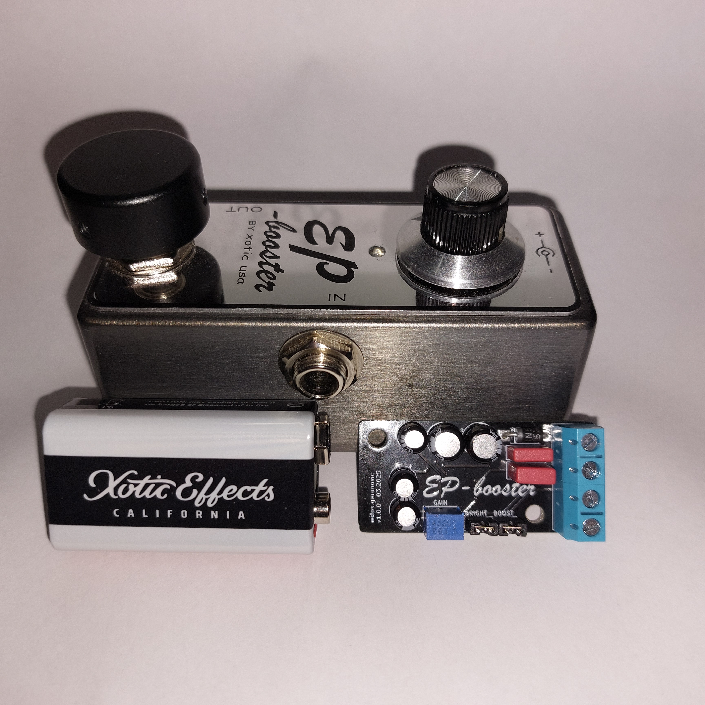
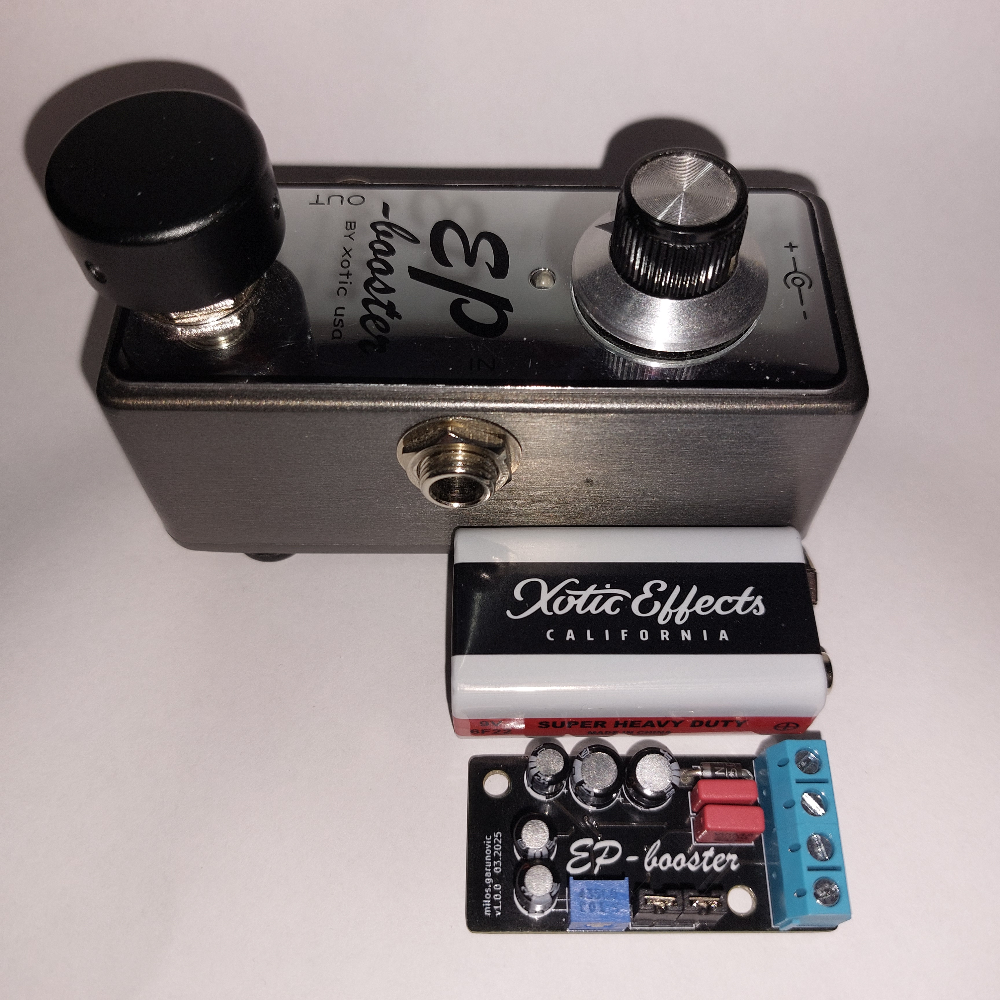

# ep_booster

KiCad project for EP Booster

---

The idea with this project is to have it in one place, with some "standards" like to view everything in KiCad and export
for manufacturing.

As a bassist, I'm using EP Booster as always on pedal in vintage mode without a boost, and it gives a nice warmth to my
custom bass with jazz pickups, and better thump with my Squier VM Precision with Wilde P-46 pickup.

Since I already have the pedal, first version will actually be ready to put into the bass, so it will use a trim pot,
but that can be wired onto a 10k pot if you want to have an "interface" to boost.

I guess the battery for eq part will last a long time in bass, since I was running it as a pedal for 3-4 months as
always-on on battery, and with stripped components (especially LED), it should last even longer. I'll have to do
measurements and write that here.

---

## Usage

If you want Vintage mode (like me) without a boost, use 10K resistor instead of the trim pot, and you can leave out male
pin headers, this will make sure +3dB is off and vintage mode is on.

I've made just the first board with that so I can test it, but my plan was to use it without boost and with vintage mode
on so next ones I solder will be without those two components and I'll just put 10K resistor there.

---

Resources for the project:

- https://aionfx.com/news/tracing-journal-xotic-ep-booster-v2/ (the pedal I've made is 100% based on this)
- https://www.taydakits.com/instructions/ep-booster/pages/designators-and-components--20
- https://revolutiondeux.blogspot.com/2012/01/xotic-ep-booster.html
- http://toshi.life.coocan.jp/review/en_diy_booster_surface_mount.html
- https://www.amp-fx.de/ep-preamp-booster-en.htm (this one is interesting because it has more caps to change the
  characteristic of the vintage mode)
- https://guitar-electronics.eu/en_US/p/EP-BOOSTER-kit-ULTRA/408

---

I've copied the AionFx to KiCad but without R15 and LED1 since I'm not planning to put that into the bass, but that
can be added later, and we can just bypass it or leave the components out, or rather not use it. I hope that won't
affect tone because it might lower the voltage a bit. I'll test with my pedal to see if there's any difference and make
changes to the schematic if necessary, but I don't need LED so if it does lower voltage and affects tone, I'll have to
find a workaround.

Since I'll be using trimmer instead of potentiometer, it doesn't matter if it's audio/linear/log/reverse audio, I'm
planning to keep it at lowest value anyway, so it works without a boost. But if a signal from bass is weak, it can serve
as a boost to get hotter signal out of the bass. This will consume more battery.

---

I'll try to keep the footprint of the PCB less than the 9V battery size, the idea being that you can have two 9V battery
slots in the bass, where 1 is the battery itself and other is this in the shape of another battery. I'll create a 3D
case for it, but that should be easy once everything is working.

---

[Here's more info about EP Booster Vintage mode.](ep_booster_info.md)

---

TODO:

1. Add bypass switch that also disconnects the battery, so it's easy to bypass on low battery. This can even be soldered
   to push/pull pot
2. Add low battery indicator (but that can be separate circuit). This needs to be tested at how low voltage does the
   audio signal degrade the circuit.
3. Add LED and current limiting resistor R15 to the schematic so it's complete, but it doesn't have to be on the board
4. Make 3D case that should be the same size as battery, so positioning can be like two batteries one next to other, but
   should keep in mind the switches and pot, they should be available for easy modification.
5. Experiment with different capacitor values like the one from amp-fx, to see if there's anything better or is it maybe
   per bass better
6. Voltage doubler combined with EP booster for more headroom. Maybe put a switch there so you can choose if you want to
   use 9 or 18v.
7. PCB that can be put on a push/pull switch
8. Thru hole option with 2N5457 and 2SC1815 (from [Xotic EP Booster](Xotic%20EP%20Booster.png),
   [link](https://tagboardeffects.blogspot.com/2012/02/xotic-ep-booster-briggs-modded.html))